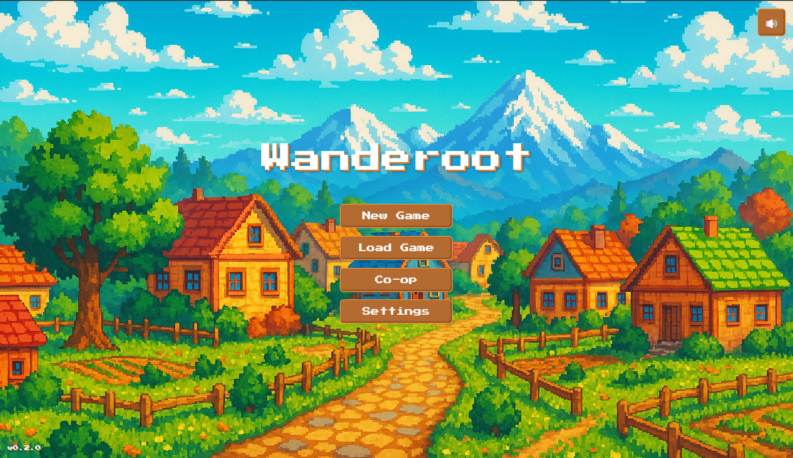

# Wanderoot

A 2D RPG game built with React, Redux, and Electron.



🎮 [Play Online](https://wanderoot.net) | 📥 [Download Desktop Version](#-download--install)

## 📥 Download & Install

### Windows
1. Go to the [Releases](https://github.com/jarekjar/wanderoot/releases) page
2. Find the latest version
3. Download `Wanderoot-Setup-x.x.x.exe`
4. Run the installer
5. Launch Wanderoot from your Start Menu or Desktop shortcut

### macOS !!!Coming Soon, need an apple Cert
1. Go to the [Releases](https://github.com/jarekjar/wanderoot/releases) page
2. Find the latest version
3. Download the appropriate version for your Mac:
   - For Macs with Apple Silicon (2020 or later): Download `Wanderoot-x.x.x-arm64.dmg` for best performance
   - For Intel-based Macs (pre-2020): Download `Wanderoot-x.x.x-x64.dmg`
   - Not sure? Click Apple menu () > About This Mac. Look for "Chip" or "Processor"
4. Double-click the downloaded .dmg file
5. Drag Wanderoot to your Applications folder
6. Launch from Applications

## ✨ Features

- Character creation with multiple classes (Knight, Ranger, Mage)
- Dynamic dialogue system with text animations
- Save/Load game functionality with multiple save slots
- In-game menu system with settings
- Configurable audio settings (music volume, sound effects)
- Pause functionality
- Beautiful pixel art graphics
- Original soundtrack

## 🚀 Development

### Prerequisites

- Node.js (v20 or higher)
- npm (included with Node.js)

### Setup

```bash
# Clone the repository
git clone https://github.com/jarekjar/wanderoot.git
cd wanderoot

# Install dependencies
npm install

# Start development server
npm run electron-dev
```

### Building

```bash
# Create Windows installer
npm run pack:win

# Create macOS installer
npm run pack:mac

# Create both Windows and macOS installers
npm run electron-pack
```

### Project Structure

```
wanderoot/
├── src/               # Source code
│   ├── assets/       # Game assets (sprites, audio)
│   ├── components/   # React components
│   ├── state/        # Redux store and slices
│   ├── styles/       # CSS styles
│   ├── theme/        # Theme configuration
│   ├── types/        # TypeScript type definitions
│   └── utils/        # Utility functions
├── electron/         # Electron main process
└── public/          # Static assets
```

## 🛠️ Built With

- React - UI framework
- Redux - State management
- Electron - Desktop application framework
- TypeScript - Type safety
- Tailwind CSS - Styling
- Vite - Build tool

## 📝 License

MIT


## 🎮 Current Development Status

Wanderoot is currently in early development (v0.1.0). Key features implemented:
- Basic game menu and settings interface
- Sound system with background music and effects
- Pause functionality
- Dialogue system
- Basic UI theming

## 🚀 Getting Started

### Prerequisites
- Node.js 20.x or higher
- npm 10.x or higher
- Git

### Installation

1. Clone the repository:
```bash
git clone https://github.com/yourusername/wanderoot.git
cd wanderoot
```

2. Install dependencies:
```bash
npm install
```

### Development

Run the development version with hot reload:
```bash
npm run electron-dev
```

This will:
- Start the Vite development server
- Launch the Electron application
- Enable hot reload for both frontend and Electron processes

### Building

Create a production build:
```bash
npm run electron-pack
```

This generates:
- A Windows installer in the `release` directory
- Named format: `Wanderoot-Setup-x.x.x.exe`

## 🏗️ Project Structure

```
wanderoot/
├── electron/          # Electron main process files
├── src/
│   ├── components/   # React components
│   ├── state/        # Redux store and slices
│   └── utils/        # Utility functions
└── dist/             # Production build output
```

## 🔧 Technical Stack

- **Frontend**: React 19, TypeScript
- **State Management**: Redux Toolkit
- **Game Engine**: PixiJS 8
- **Build Tools**: Vite, Electron Builder
- **Audio**: Howler.js
- **Styling**: Tailwind CSS

## 🎵 Audio System

The game features a dynamic audio system with:
- Background music that responds to game state
- Sound effects for UI interactions
- Volume control
- Automatic pause handling

## 🚀 Release Process

1. Update version in `package.json`
2. Create and push a new tag:
```bash
git tag v[version]
git push origin main --tags
```
3. GitHub Actions will automatically:
   - Build the application
   - Create a GitHub release
   - Attach the portable executable
   - Deploy to GitHub Pages

## 🌐 Web Version

The game is also available to play directly in your browser through GitHub Pages at:
https://jarekjar.github.io/wanderoot/

Note: The web version has some limitations compared to the desktop version:
- No file system access for save games (uses browser localStorage instead)
- Some features may be browser-dependent
- Performance may vary based on your browser and device

## 🤝 Contributing

We welcome contributions! Please:
1. Fork the repository
2. Create a feature branch
3. Submit a Pull Request

## 🙏 Acknowledgments

- Special thanks to the Cursor Agent for assistance in development!
